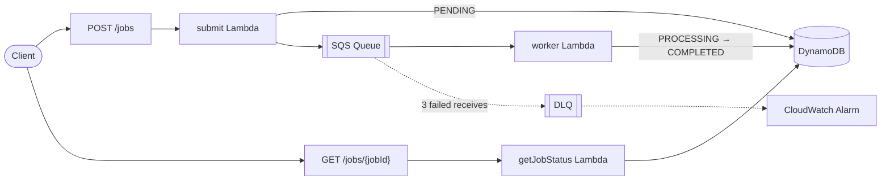

# AWS Job Status API

A serverless async job processing API built on AWS. Clients submit jobs via HTTP and poll for status — the system decouples submission from processing using SQS, with all state tracked in DynamoDB.

## Problem

Long-running work shouldn't block an HTTP request. This service accepts a job, returns immediately with a `jobId`, processes the job in the background, and lets the client poll for its status. SQS decouples submission from processing, so spikes are buffered and failures are retried automatically.

## Architecture



See [docs/architecture-diagram.md](docs/architecture-diagram.md) for the full diagram and request sequence, and [docs/architecture.md](docs/architecture.md) for the original design notes.

## Tech Stack

- **Runtime**: Node.js 22 / TypeScript
- **Compute**: AWS Lambda (3 functions)
- **Queue**: Amazon SQS with Dead Letter Queue
- **Database**: Amazon DynamoDB (on-demand)
- **API**: Amazon API Gateway v2 (HTTP API)
- **Observability**: CloudWatch alarm on DLQ depth
- **IaC**: Terraform (remote state in S3)

## API

| Method | Path | Description |
|--------|------|-------------|
| `POST` | `/jobs` | Submit a new job. Returns `202` with a `jobId`. |
| `GET` | `/jobs/{jobId}` | Poll job status. Returns `jobId`, `status`, `type`, `createdAt`. |

**Submit request body:**
```json
{ "type": "your-job-type" }
```

**Job status values:** `PENDING` → `PROCESSING` → `COMPLETED`

**Poll response:**
```json
{
  "jobId": "550e8400-e29b-41d4-a716-446655440000",
  "status": "COMPLETED",
  "type": "your-job-type",
  "createdAt": "2026-06-05T12:00:00.000Z"
}
```

## Project Structure

```
src/handlers/
  submit.ts          # POST /jobs — writes to DynamoDB + SQS
  worker.ts          # SQS consumer — processes jobs, updates status
  getJobStatus.ts    # GET /jobs/{jobId} — reads from DynamoDB
terraform/
  main.tf            # Provider + S3 backend config
  api_gateway.tf     # HTTP API + routes + integrations
  lambda.tf          # Lambda functions + SQS event source mapping
  dynamodb.tf        # Jobs table (PAY_PER_REQUEST)
  sqs.tf             # Main queue + DLQ with redrive policy (maxReceiveCount=3)
  iam.tf             # Per-function least-privilege roles + policies
  cloudwatch.tf      # DLQ depth alarm
tests/
  submit.test.ts         # Jest unit tests for submit handler
  getJobStatus.test.ts   # Jest unit tests for getJobStatus handler
  worker.test.ts         # Jest unit tests for worker handler
docs/
  architecture-diagram.md  # Mermaid architecture + sequence diagrams
  architecture.md          # Design notes
.github/workflows/ci.yml   # Lint, build, test on every push
```

## IAM Design

Each Lambda function has its own role scoped to only the permissions it requires:

| Function | DynamoDB | SQS |
|----------|----------|-----|
| submit | `PutItem` | `SendMessage` |
| worker | `GetItem`, `UpdateItem`, `PutItem` | `ReceiveMessage`, `DeleteMessage`, `GetQueueAttributes` |
| getJobStatus | `GetItem` | — |

## Error Handling

- Invalid requests return `400` with a descriptive message (missing `type` on submit, missing `jobId` on poll)
- Jobs not found return `404`
- The worker is idempotent: jobs already `PROCESSING` or `COMPLETED` are skipped on redelivery
- Worker failures are retried up to 3 times via SQS visibility timeout before routing to the DLQ
- A CloudWatch alarm fires when the DLQ receives any message
- All handlers emit structured JSON logs

## Local Development

```bash
npm install
npm run lint     # ESLint
npm run build    # tsc + zip Lambda bundles into lambda/
npm test         # Jest unit tests (AWS SDK clients are mocked)
```

CI (`.github/workflows/ci.yml`) runs lint, build, and test on every push and pull request.

## Deploy

**Prerequisites:** AWS CLI configured, Terraform >= 1.0, Node.js 22

```bash
# 1. Build Lambda zips
npm install
npm run build

# 2. Deploy infrastructure
cd terraform
terraform init
terraform apply
```
