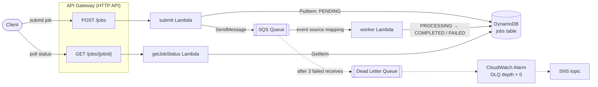
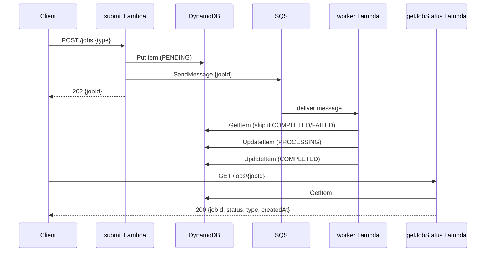

# Architecture Diagram

```mermaid
flowchart LR
    Client([Client])

    subgraph API["API Gateway (HTTP API)"]
        POST["POST /jobs"]
        GET["GET /jobs/{jobId}"]
    end

    Submit["submit Lambda"]
    Status["getJobStatus Lambda"]
    Worker["worker Lambda"]
    Queue[["SQS Queue"]]
    DLQ[["Dead Letter Queue"]]
    DB[("DynamoDB<br/>jobs table")]
    Alarm["CloudWatch Alarm<br/>DLQ depth > 0"]

    Client -->|submit job| POST --> Submit
    Client -->|poll status| GET --> Status
    Submit -->|PutItem: PENDING| DB
    Submit -->|SendMessage| Queue
    Queue -->|event source mapping| Worker
    Worker -->|PROCESSING → COMPLETED / FAILED| DB
    Status -->|GetItem| DB
    Queue -.->|after 3 failed receives| DLQ
    DLQ -.-> Alarm
    Alarm -.-> SNS["SNS topic"]
```

## Sequence: submit and poll

```mermaid
sequenceDiagram
    participant C as Client
    participant S as submit Lambda
    participant D as DynamoDB
    participant Q as SQS
    participant W as worker Lambda
    participant G as getJobStatus Lambda

    C->>S: POST /jobs {type}
    S->>D: PutItem (PENDING)
    S->>Q: SendMessage {jobId}
    S-->>C: 202 {jobId}
    Q->>W: deliver message
    W->>D: GetItem (skip if COMPLETED/FAILED)
    W->>D: UpdateItem (PROCESSING)
    W->>D: UpdateItem (COMPLETED)
    C->>G: GET /jobs/{jobId}
    G->>D: GetItem
    G-->>C: 200 {jobId, status, type, createdAt}
```
